# Práctica Pablo Cazallas - Liberando productos

## A. Nuevo endpoint + Unit tests

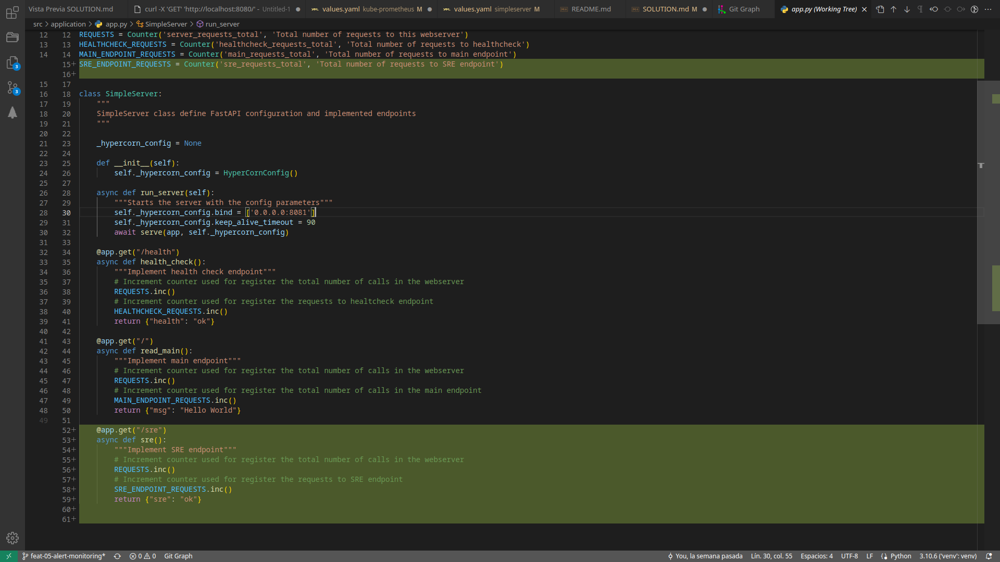
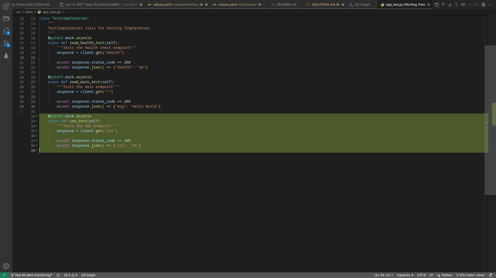
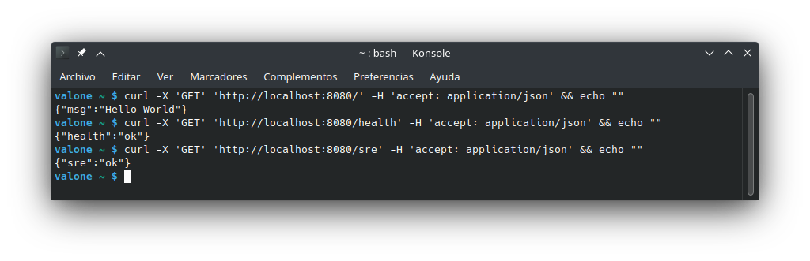
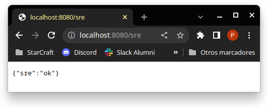
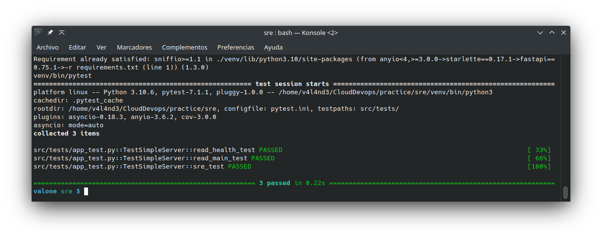
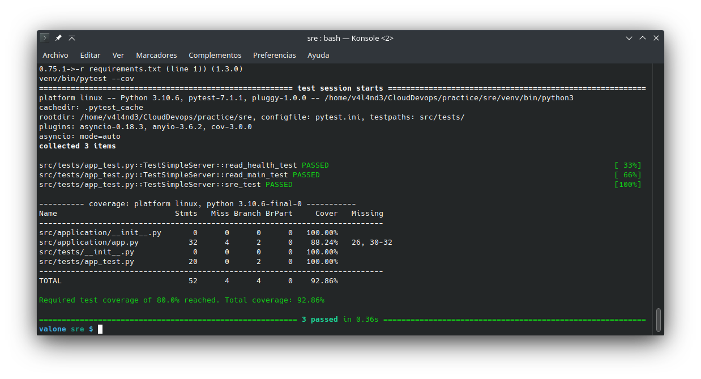  


## B. Creación de helm chart para desplegar la aplicación en Kubernetes

1. Construir la imagen del contenedor.  
    ```
    # Manualmente:
    $ docker build -t <imgname>:<imgver> .

    # Mediante el comando 'make' y las definiciones del Makefile:
    $ make docker-build
    ```  

2. Etiquetar y publicar la imagen creada en un registry online.  
    Publicar en Github Packages:
    ```
    # Manualmente:
    $ docker tag <imgname> ghcr.io/<githubuser>/<imgname>:<imgver>
    $ docker push ghcr.io/<githubuser>/<imgname>:<imgver>
    ```
    Publicar en Docker Hub:
    ```
    $ docker tag <imgname> [docker.io/]<dockerhubuser>/<imgname>:<imgver>
    $ docker push [docker.io/]<dockerhubuser>/<imgname>:<imgver>
    ```  
    Publicar en ambos registros (mediante el comando `make` y las definiciones del Makefile):
    ```
    $ make publish
    ```

3. Arrancar minikube con un nuevo perfil `practica-sre`.  
    ```
    $ minikube start --memory=4096 --addons="metrics-server,default-storageclass,storage-provisioner" -p practica-sre
    ```

4. Crear un helm chart para desplegar la aplicación en kubernetes (con minikube).  
    ```
    $ helm create simpleserver
    ```

    Modificar los atributos del fichero `values.yaml`.  
    ```
    repository: valande/sre-ss
    ...

    service:
      type: ClusterIP
      port: 8081
    ...
    ```

    Modificar el atributo `appVersion` del fichero `Chart.yaml`.  

    Desplegar el chart:
    ```
    $ helm install <release_name> simpleserver
    ```

    Seguir las instrucciones de las NOTES:
    ```
    NAME: ss-02
    LAST DEPLOYED: Wed Apr 26 13:58:23 2023
    NAMESPACE: default
    STATUS: deployed
    REVISION: 1
    NOTES:
        1. Get the application URL by running these commands:
        export POD_NAME=$(kubectl get pods --namespace default -l "app.kubernetes.io/name=simpleserver,app.kubernetes.io/instance=ss-02" -o jsonpath="{.items[0].metadata.name}")
        export CONTAINER_PORT=$(kubectl get pod --namespace default $POD_NAME -o jsonpath="{.spec.containers[0].ports[0].containerPort}")
        echo "Visit http://127.0.0.1:8080 to use your application"
        kubectl --namespace default port-forward $POD_NAME 8080:$CONTAINER_PORT
    ```  

## C. Creación de pipelines CI/CD

Se ha utilizado Github Actions, con la configuración establecida en los ficheros yaml del directorio `.github/workflows`.  

Es necesario crear un token personal con los permisos de manejo de `packages`:  

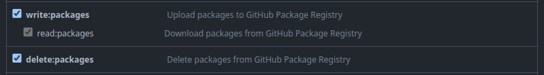


Es necesario definir los secretos para poder hacer login frente a los registros de contenedores. Esto se define en la sección de `Actions` de los `Settings` del repo:  

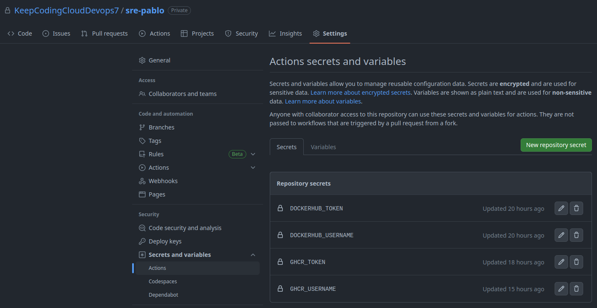  


Ejecución de pipelines puede verse en el apartado `Actions` del proyecto:  

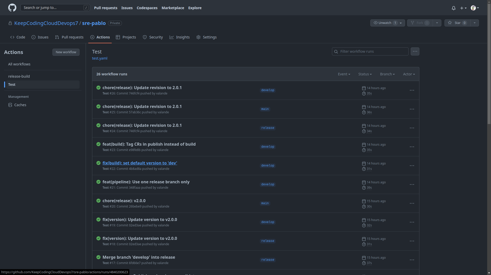
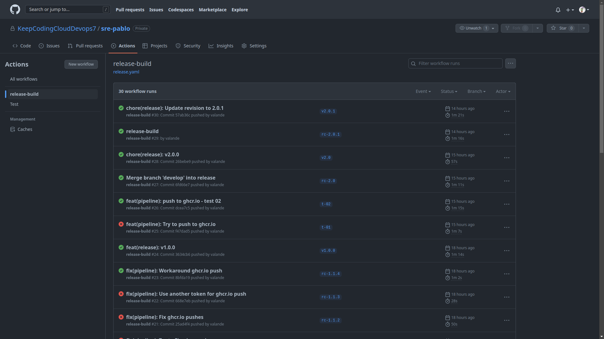  


Los artefactos generados se publican tanto en ghcr.io como en el hub de docker:  

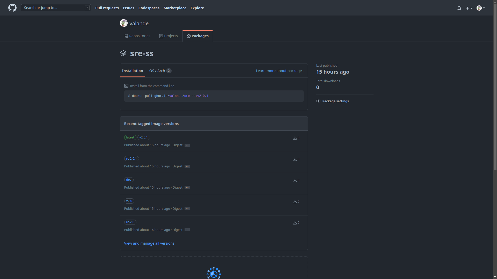
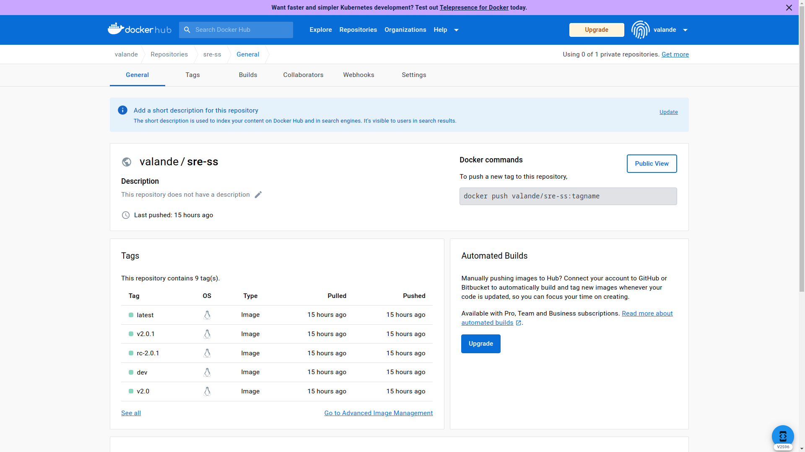  


## D. Monitorización y alertas - Prometheus, Grafana

1. Añadir fichero values.yaml correspondiente al stack `kube-prometheus-stack`, para su instalación vía Helm.
2. Definir la sección `metrics` en el fichero `values.yaml` del chart `simpleserver`.
3. Configurar `apiUrl` (Webhook de Slack, mediante app "Incoming WebHooks") y `channel` (Channel de Slack) en la sección `alertmanager` del fichero `values.yaml` correspondiente al stack `kube-prometheus`.
4. Definir las alertas de monitorización en la sección `additionalPrometheusRulesMap` del mismo fichero.
5. Instalar el stack de monitorización:
    ```
    $ helm repo add prometheus-community https://prometheus-community.github.io/helm-charts
    $ helm repo update
    ...

    $ helm -n monitoring upgrade --install prometheus prometheus-community/kube-prometheus-stack \
        -f kube-prometheus/values.yaml --create-namespace --wait --version 34.1.1
    ``` 
6. Instalar el chart `simpleserver`:
    ```
    $ helm -n simpleserver upgrade ss-sre --wait --install --create-namespace simpleserver
    ```
7. Hacer algunos `port-forward` para exponer los servicios creados:
    ```
    $ kubectl -n monitoring port-forward svc/prometheus-grafana 3000:http-web
    ```
    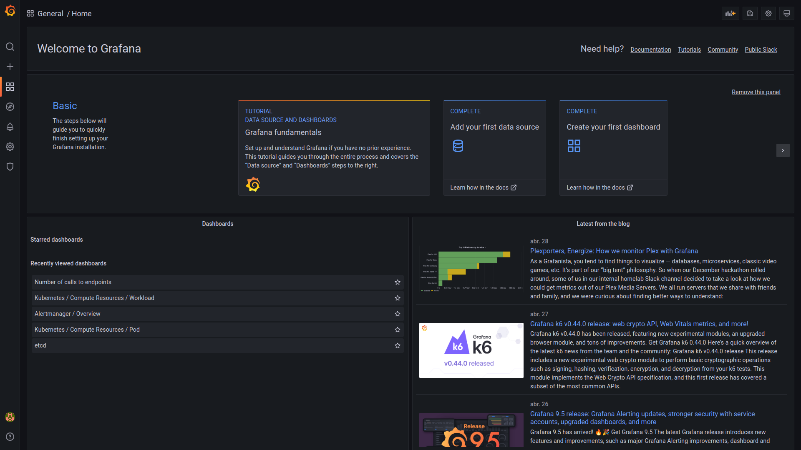
    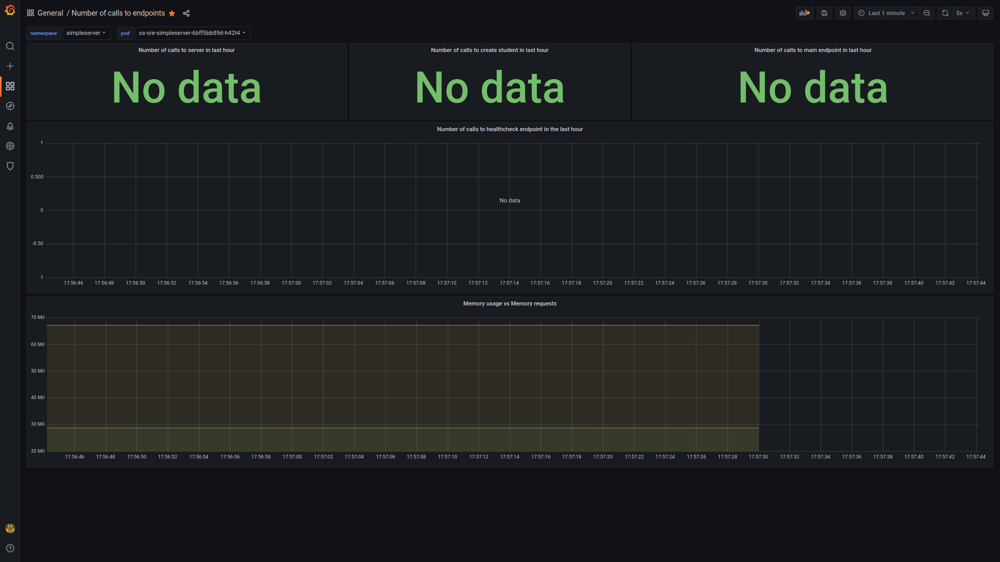
    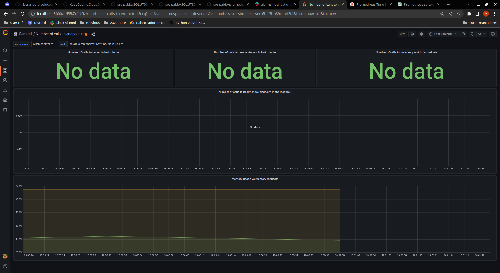

    ```
    $ kubectl -n monitoring port-forward svc/prometheus-kube-prometheus-prometheus 9090:9090
    ```
    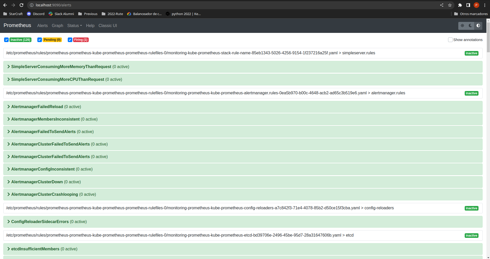
    
    ```
    $ kubectl -n simpleserver port-forward svc/ss-sre-simpleserver 8080:8081
    ```
    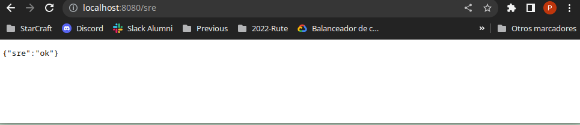
    
    Además, si se hace `port-forward` sobre el pod para el puerto 8000:8000, se pueden observar las métricas de Prometheus:
    ```
    $ kubectl -n simpleserver port-forward <pod> 8000:8000
    ```
    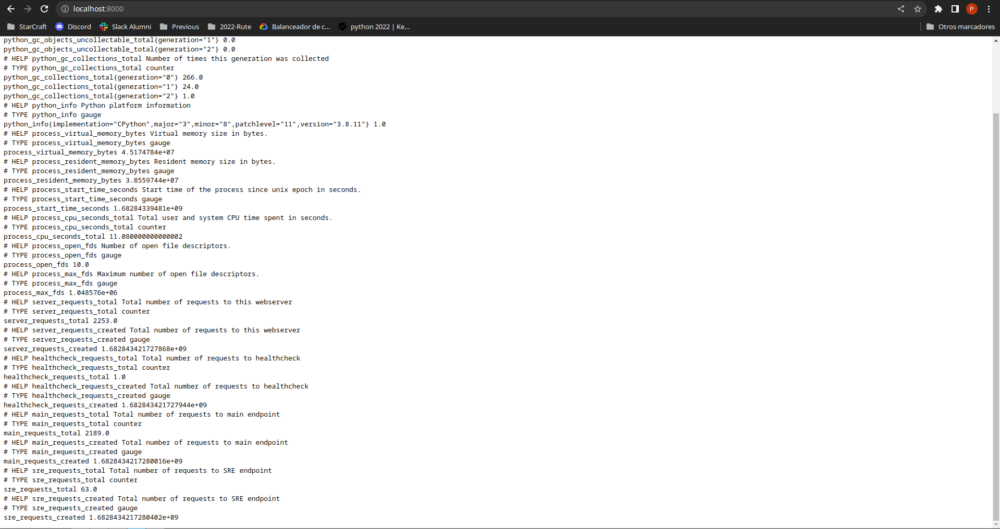

